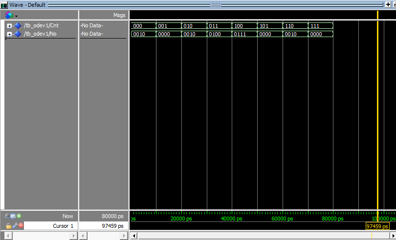

#Dec_No (VHDL)

EEEN 360 **FPGA ile Sayısal Tasarım** dersi kapsamında hazırlanmış bir vize ödevi.

## Projenin Amacı
Bu proje, öğrenci numarasındaki belirli haneye göre tanımlanan doğruluk tablosunu temel alarak
**3-bit girişli (Cnt) → 4-bit çıkışlı (No)** bir decoder devresinin VHDL ile tasarımını içerir.

- **Giriş:** `Cnt` (3-bit)
- **Çıkış:** `No` (4-bit)
- **Testbench:** `Cnt` sinyalini 10 ns aralıklarla artırır ve 80 ns sürede tüm kombinasyonları dener.
- **Doğrulama:** Simülasyon sonucu VCD dosyası (`dec_no.vcd`) ve dalga şekilleri (`Dec_no_sim.png`) ile kontrol edilir.

## Çalıştırma (opsiyonel yeniden üretim)
```tcl
vsim -do scripts/run_vcd.do
```
Bu komut `waves/dec_no.vcd` dosyasını yeniden oluşturur.

## Yapı
- `rtl/Dec_No.vhd`: DUT
- `tb/tb_Odev1.vhd`: Testbench
- `scripts/run_vcd.do`: Sim betiği (opsiyonel)
- `waves/`: VCD (`dec_no.vcd`) ve sim görüntüsü (`Dec_no_sim.png`)
- `docs/`: İlgili doküman(lar)

## Notlar
- VCD dosyası zaten repoda mevcut. Yeniden üretmek istersen `run_vcd.do` kullanılabilir.
- VCD dosyası büyümesin istersen `run_vcd.do` içinde `vcd add` kapsamını sadece gerekli sinyallere daralt.
- Testbench 0..7 sayımı için 80 ns'lik bir pencere kullanır; betikte 100 ns koşturuyoruz.

- ## Simülasyon

Aşağıda testbench sonucunda elde edilen dalga şekli gösterilmektedir:



